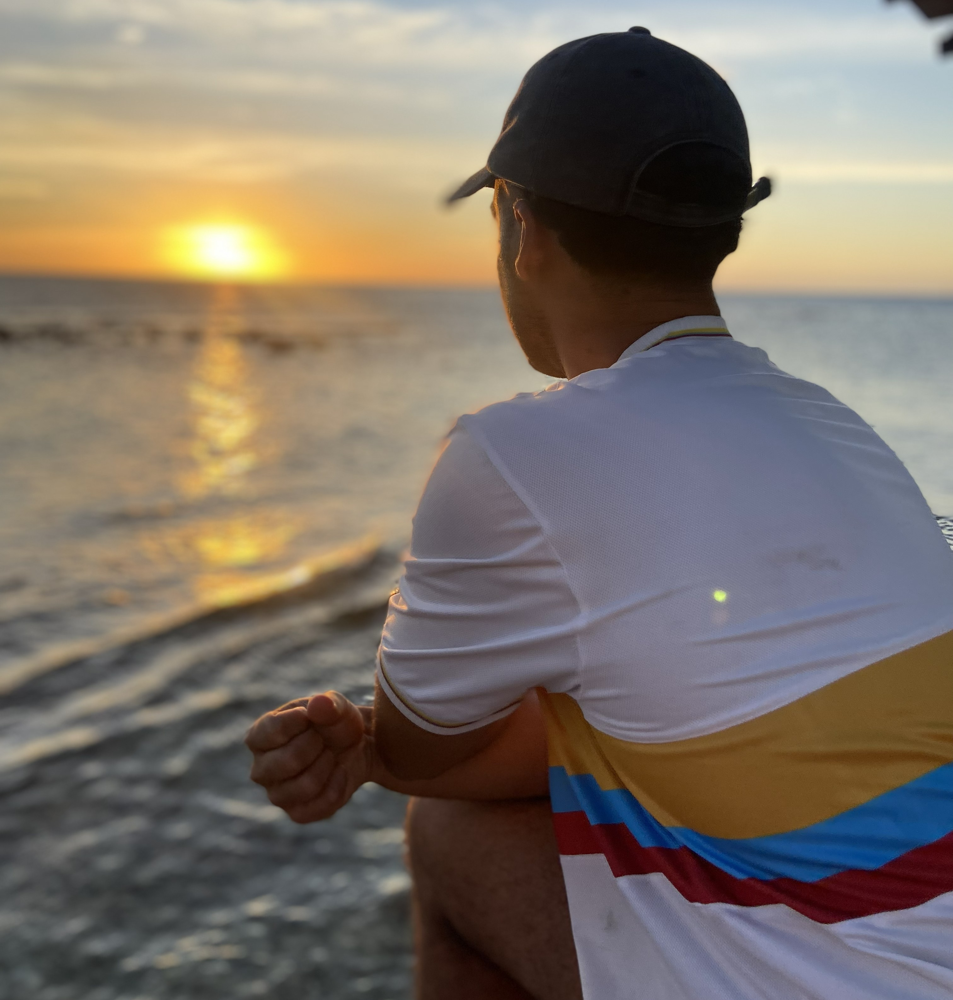

## A (very) short educational history

Just as my interests are broad, so too was my formal education. I started at the bench, pipetting and centrifuging in search of new drugs during my Bachelor's in Pharmaceutical Sciences at [Utrecht University](https://www.uu.nl/en). A course in Psychopharmacology changed everything: I fell in love with neuroscience and went on to pursue a Master's in Neuroscience & Cognition, also at [Utrecht University](https://www.uu.nl/en). From there, I completed a cognitive neuroscience PhD at [Leiden University](https://www.universiteitleiden.nl/en), where I tried to uncover the neuromodulatory underpinnings of why our focus seems so unstable.

Along the way, I have been part of many wonderful lab groups. During my time in Utrecht, I worked with the [Infection and Immunity lab](https://www.infectionandimmunity.nl/research-groups/details/eijkelkamp) of Niels Eijkelkamp and the [Iris Sommer lab](https://www.rug.nl/about-ug/latest-news/press-information/scientists-in-focus/sommer-prof-iris?lang=en) (then at UMC Utrecht, now at the University of Groningen), and a research visit took me to the [Klingberg lab](https://www.klingberglab.se/) at Karolinska Institutet in Stockholm. My PhD was embedded in the [Temporal Attention lab](https://sander-nieuwenhuis.github.io/research/) of Sander Nieuwenhuis at Leiden University. Currently, I am a postdoctoral researcher in both the [Memory and Emotion lab](https://www.ru.nl/en/departments/donders-community-for-medical-neuroscience/memory-emotion) led by Nils Kohn at Radboudumc and the [food and cognition group](http://www.esther-aarts.com/) led by Esther Aarts at Radboud University.

## A (very) short personal history

I was born on the One Happy Island: Aruba. As a child from a Colombian-Caribbean mother and an Aruban father, my upbringing was a beautiful mess of Latin-American and Dutch influences. We moved to the Netherlands when I was toddler, after which I did my primary and secondary school in Nijmegen and my university studies in Utrecht. Now, I still live in Utrecht, where I play football, do climbing, read books and am always looking forward to holidays with lots of hiking!

  

